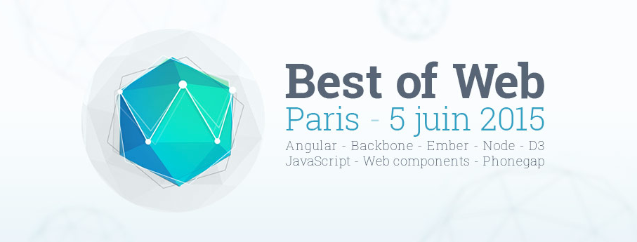
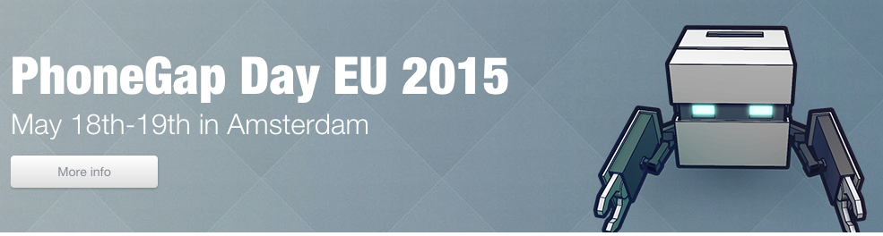

# Phonegap/Cordova Paris Meetup #11 du 25/05/2015 @NUMA

## Best Of Web

 - http://bestofweb.paris
 - Le meilleur des meetups Parisiens se réunissent le 5 Juin
 - 2 places offertes pour nos speakers !

## Applications mobiles avec Phonegap et Cordova

 - dispo chez Eyrolles Bd St Germain et en ligne + Amazon et autres
 - http://www.eyrolles.com/Informatique/Livre/applications-mobiles-avec-cordova-et-phonegap-9782212140521

## Tooling
 - https://github.com/KrauseFx/fastlane : app store deployment & app management. automate the apple publication process.
 - http://tarifa.tools par @42loops : speaker bestofweb & auteur de tarifa.tools : multiple configurations build tool, cordova toolchain automation

## Recap PG Day 2015

- vidéos en ligne SOON
- Phonegap :
    - +300 releases les 18 derniers mois
    - cordova 5:
        - pluggable webviews
        - independently upgradable platforms
        - embedded webview possible, not only full webview
    - Apache cordova on npm -> move from registry, all plugins now npm-based (6 months deadline for the registry)
    - phonegap desktop app
    - phonegap push/pull
    - apple allow JS hot-updating
    - phonegap-plugin-contentsync -> plugin with a simple API to fetch & catch remote ressources on local FS via native code.
- perfs : http://fr.slideshare.net/sydlawrence/high-performance-phonegap-apps
- ionic : release 1.0, pg deploy & update, better perfs with angular2
- Android webkit webview still 50% market + fragmentation -> manual test + crosswalk
- crosswalk -> +perfs +pluggable +customisable +webgl
- @42: https://docs.google.com/presentation/d/1dKUvDuPFhj0DnoNAB55wE9923itmHKf0FAGFptMf6FQ/pub
    - Cordova Games perfs, store & sdk tips
    - leaderboars & achievements management, signin, revenues with play services (google) & game center (iOs)
    - game-center unified plugin

## Tonight

 - **Loïc Knuchel** @loicknuchel Ionic c'est pas que de l'UI, découvrez les outils pour vous faciliter la vie by loicknuchel@gmail.com -> [SLIDES](./ionic-loic-knuchel.pdf)
 - **Benjamin Michel** @benjmichel Des maps en offline pour une appli hybride par Benjamin Michel :  [SLIDES](./Offline_maps-Benjamin_Michel.pdf)  http://blog.bamlab.fr/how-to-build-an-offline-map-system-for-an-hybrid-app by benjaminm@bamlab.fr 
