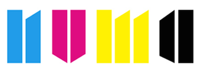

# Meetup #12 du 23/09/2015 @NUMA

## Applications mobiles avec Phonegap et Cordova

 - dispo chez Eyrolles Bd St Germain et en ligne + Amazon et autres
 - http://www.eyrolles.com/Informatique/Livre/applications-mobiles-avec-cordova-et-phonegap-9782212140521

## Community

- plus de meetups cette année, hybride++
- on a besoin de speakers, talks ~20min ou lightnings 5min -> PR sur github
- page github : https://github.com/Phonegap-Cordova-Paris/meetups
- slack : http://cordova.slack.io avec channel #france
- qui a déja publié des apps cordova ?
- gens intéréssés par des workshops initiation ?
- recherche lieux/sponsors -> PR sur github

## Tonight

### **ACTU PG/Cordova** Maxime Alexandre de mobile-spot

### Intégration de la **carto GoogleMap native** dans un projet Cordova par Yann Leflour de BamLab.fr : 

http://slides.com/yannleflour/maps-in-cordova#/

### **Intégration continue** avec Cordova et Circle CI par Eliot Andres de BamLab.fr

https://github.com/bamlab/CircleCI-Scripts

### **Intégration de Cordova** dans une application native par Benjamin Michel de BamLab.fr

https://speakerdeck.com/benjmichel/integrer-cordova-dans-une-appli-native
